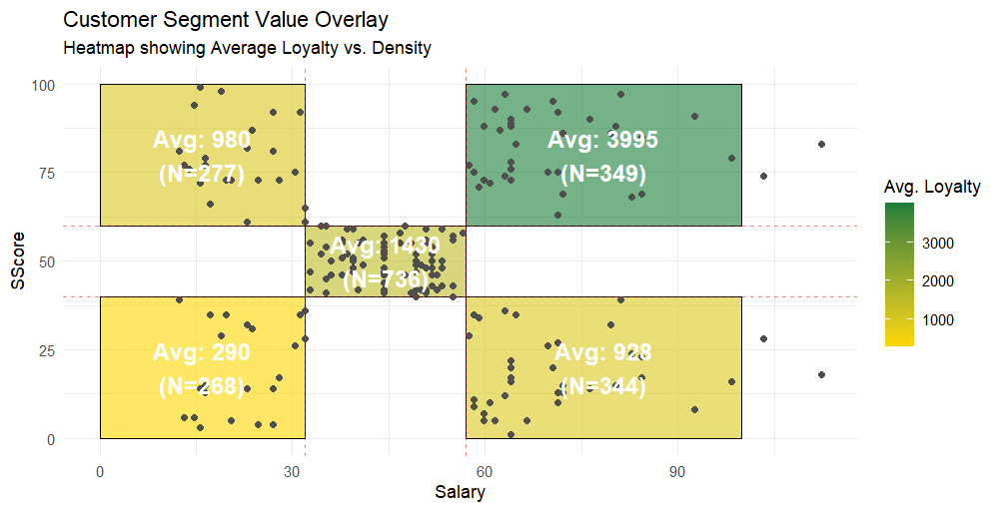

# Customer Segmentation and Loyalty Modelling

## Overview

This project applies **unsupervised and supervised machine learning techniques** to analyse customer behaviour and model loyalty programme performance.

The objectives were:

- Identify meaningful **customer segments**
- Understand the drivers of **loyalty points earned**
- Build predictive models for **loyalty behaviour**
- Translate behavioural data into actionable insights

This project demonstrates a **full end-to-end data science workflow**, from exploratory analysis and feature engineering through to modelling and interpretation.

---

## Example output


---

## Dataset

The dataset contains customer-level information including:

- Salary
- Spending Score
- Age
- Gender
- Education
- Loyalty Points

The target variable is:

**Loyalty Points**

---

## Techniques Used

### Unsupervised Learning

- K-Means Clustering
- DBSCAN
- Hierarchical Clustering
- Customer Segmentation

### Supervised Learning

- Decision Tree Classification
- Multiple Linear Regression
- Polynomial Regression
- Interaction Models
- Log Transformation

### Statistical Analysis

- Residual diagnostics
- Normality testing
- Skewness and kurtosis analysis
- Variance stabilisation

---

## Project Structure

```
customer-segmentation-loyalty-model/
│
├── customer_segmentation.R
├── turtle_reviews.csv
├── README.md
```

---

## Exploratory Analysis

Initial analysis identified strong relationships between:

- Salary and Loyalty Points
- Spending Score and Loyalty Points

Exploration showed that **segmentation improved model interpretability**, suggesting customer groups behave differently.

---

## Customer Segmentation

Several clustering approaches were evaluated:

- K-Means clustering
- DBSCAN clustering
- Hierarchical clustering

Hierarchical clustering produced the most interpretable customer groups.

Segmentation was primarily driven by:

- Salary
- Spending Score

---

## Segment Value Heatmap

This visualisation combines:

- Customer density (scatter plot)
- Segment boundaries
- Average loyalty value per segment

This allows easy identification of **high-value customer segments**.

### Example Output


---

## Predictive Modelling

Several models were evaluated.

### Baseline Model

```
loyalty_points ~ salary
```

Performance improved substantially when including:

- Spending Score
- Interaction terms
- Polynomial terms

---

## Final Model

```
log(loyalty_points) ~ salary + sscore + salary^2 + sscore^2
```

This model achieved:

- High explanatory power
- Stable residual behaviour
- Reduced heteroscedasticity

---

## Model Diagnostics

Model assumptions were evaluated using:

- Residual plots
- Distribution analysis
- Shapiro-Wilk tests
- Log transformation

Log transformation significantly improved model stability.

---

## Key Insights

### Salary strongly influences loyalty

Higher salary customers consistently earned more loyalty points.

### Spending score interacts with salary

Spending behaviour modifies the salary–loyalty relationship.

### Segmentation improves interpretability

Customer groups show distinct loyalty patterns.

### Non-linear modelling improves accuracy

Polynomial and interaction terms significantly improved predictions.

---

## Technologies Used

- R
- Tidyverse
- ggplot2
- dplyr
- rpart
- dbscan
- factoextra

---

## How to Run

Install required packages:

```r
install.packages(c(
"tidyverse",
"ggplot2",
"dplyr",
"dbscan",
"factoextra",
"rpart",
"rpart.plot",
"psych"
))
```

Run the script:

```r
source("customer_segmentation.R")
```

---

## Author

Jason Bagshaw  
